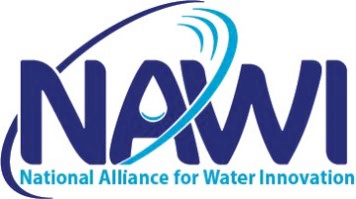

Last modified on {{ page.modified }}

&nbsp;

Welcome to the WaterTAP graphical user interface (GUI) software download page.
WaterTAP is part of the National Alliance for Water Innovation (NAWI).

## Downloads

Download installer and open on your desktop to install the software.





### Version {{ release.version }}

* <a href="{{ release.url }}">{{ release.os }}</a>



## More information

* [WaterTAP on Github](https://github.com/watertap-org/)
* [WaterTAP page on NAWI website](https://www.nawihub.org/knowledge/watertap/)
* [NAWI website home](https://www.nawihub.org/)

## Acknowledgements

> WaterTAP is funded by the US Department of Energy, Office of Energy Efficiency and Renewable Energy (EERE) under Funding Opportunity Announcement DE-FOA-0002336 (R&D for Advanced Water Resource Recovery)

> The National Alliance for Water Innovation (NAWI) Energy-Water Desalination Hub is funded by the U.S. Department of Energy, Energy Efficiency and Renewable Energy Office, Advanced Manufacturing Office under Funding Opportunity Announcement DE-FOA-0001905