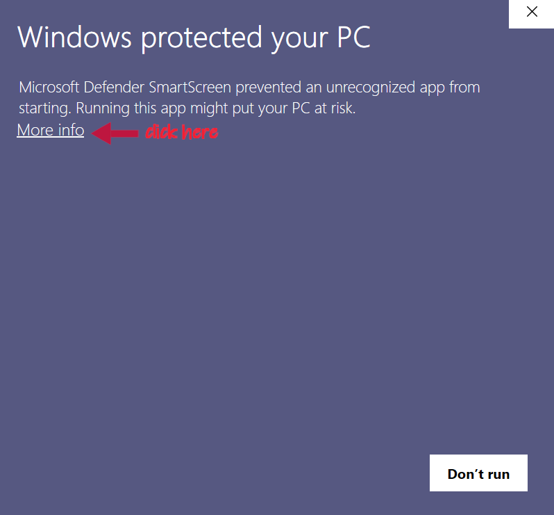
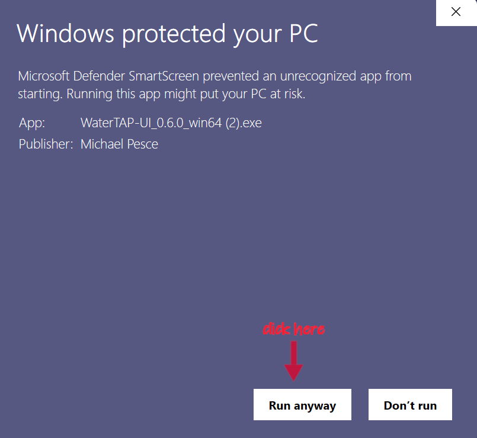
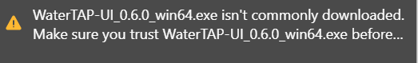
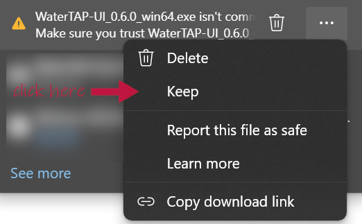
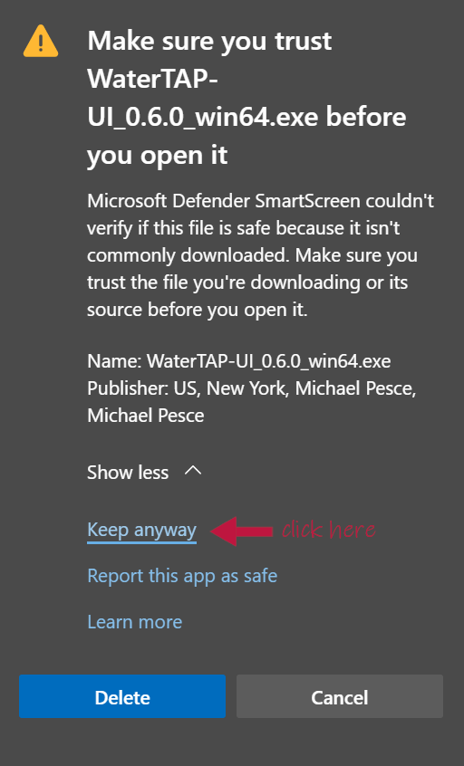

# Install warnings

<a href="">&larr; Back to main page</a>

The Windows operating system issues some security warnings when downloading the software.
Below are instructions, with screenshots, for keeping the download despite these warnings.

## Windows warnings

Due to security procedures by Microsoft, you may see warnings and need to take additional steps to download the `.exe` file for the Windows installer.
**The executable has been verified to be safe,** but due to the small number of people who have downloaded and installed it, Microsoft still regards it as an untrusted resource. Below are details on how to tell Windows to install the software anyways.

### Windows Protector warning screens

The most common form of this warning comes from Windows Protector. You will see an initial screen that looks like this (red annotation added):

As the annotation indicates, you should click on the "More info" link. This will result in a second screen that looks like this:

In this screen, click on the "Run anyway" button to begin the installation process.

### Microsoft Edge warnings

If you use the Microsoft Edge browser, you may encounter a second form of this process.
When you perform the download, the browser will show a message that looks like this:

Select the three dots next to this message and select "Keep", as indicated in the following screenshot (red annotation added):

This will bring up another window, where you need to first select "Show more" and then select the "Keep anyway" option that appears, as indicated in this screenshot (red annotation added):

