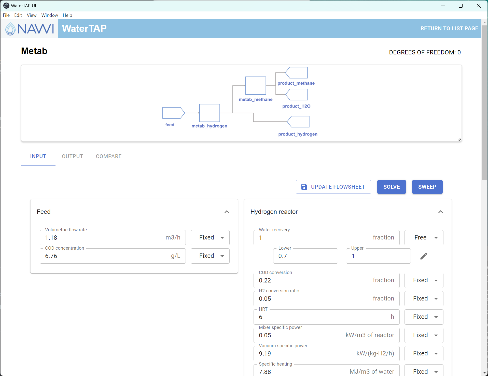
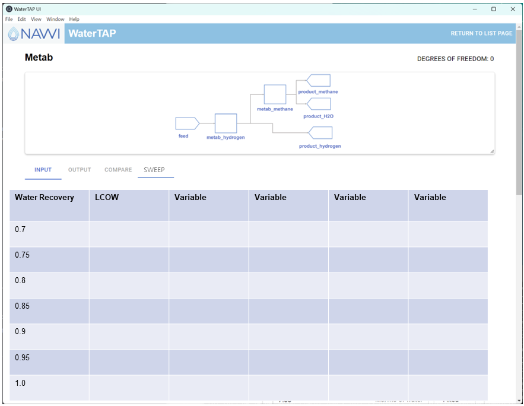
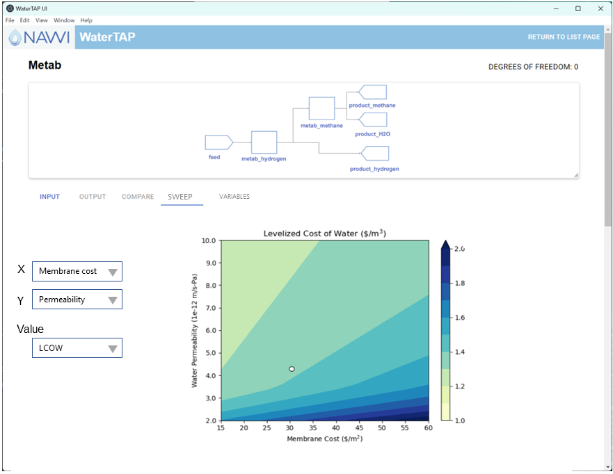

# WaterTAP User Interface Roadmap

Last Revised: 03/30/2023

## Introduction

This document provides a feature roadmap for the graphical user interface (UI) that builds on the [National Alliance for Water Innovation](https://www.nawihub.org/)'s [Water Techno-economic Assessment Platform](https://www.nawihub.org/knowledge/watertap/) (WaterTAP), which in turn leverages the algebraic modeling and optimization capabilities of the [Institute for the Design of Advanced Energy Systems](https://idaes.org/) integrated platform (IDAES-IP) for modeling and decision support for desalination and water treatment technologies. In the remainder of this document, this will be referred to simply as the *WaterTAP UI*.

This work is performed within the project "Water TAPs and DAMS Support to Advanced Water Resource Recovery FOA Projects and Related Analysis", which is funded by award number DE-AC36-08GO28308 from the DOE/EERE/ Industrial Efficiency and Decarbonization Office (IEDO).

## Goals

The WaterTAP UI will make the modeling capabilities developed using WaterTAP more usable for a broad spectrum of users. These users may be other modelers, experimentalists, operators, or the developers of the models themselves. The UI is not intended to be used to create the models; the WaterTAP project uses the complex but highly functional IDAES-IP Python API for this purpose, and a more general model builder belongs in the scope of that project. However, once a model is built, the WaterTAP UI should be able to display its configuration, allow the user to modify settings and solve the optimization problem, and produce results and reports for analysis.

The technologies chosen for developing the WaterTAP UI will be kept in alignment with other work in the IDAES-IP space, so that tools that can operate on IDAES models can be (eventually) included in the WaterTAP UI. More concretely, the WaterTAP UI uses the (currently, most-popular) [React](https://react.dev/) JavaScript framework, with the [Electron](https://www.electronjs.org/) JavaScript framework enabling installation as a cross-platform desktop application.

## Current Status

Release 0.8.0 of the WaterTAP UI contains the following major features:

- Select from a list of developed models
  - The UI framework provides Python libraries for interfacing developed models to the UI
- For a selected model:
  - View a diagram of the model with major unit operations, inlets, and outlets
  - View variables and variable expressions exported by the model developer
  - Change variables from fixed to free, and edit variable values
  - Solve the model
  - View results of solved model
  - Save solved model inputs and results
- Compare two solved models side by side
  - Export the comparison to a tabular output file that can be opened with Excel or Python code
- One-click installation
  - Downloads for Mac OSX and Windows use native installers
  - Installed WaterTAP UI opens just like any other desktop app

## Development Roadmap

The roadmap of planned enhancements to the UI is structured as a table that summarizes the planned changes and expected dates, with details for each item in a separate section with a prescribed format. The name of each item in the table is also a hyperlink to the corresponding details section.

Note that images in the "Mockups" sections are meant to merely *suggest* how the feature will look and behave. They are incomplete and the final version will look different, often significantly. 

| Target date | Name                                                         | Short Description                                            |
| ----------- | ------------------------------------------------------------ | ------------------------------------------------------------ |
| FY23 Q3     | <a href="#parameter-sweep">Parameter sweep</a>               | Allow the user to select one or more variables to sample over a range and then use the WaterTAP parameter sweep capabilities to run optimizations for the selected parameter space. Provide basic tabular output for the collected results. |
| FY23 Q3     | <a href="#advanced-model-variables">Advanced model variables</a> | Provide access to "all" model variables in a separate display from the predetermined exported variables. |
| FY23 Q4     | <a href="#parameter-sweep-plots">Parameter sweep plots</a>   | Show visual representations, i.e. plots, of the parameter sweep outputs |
| FY23 Q4     | <a href="#variable-export-wizard">Variable export wizard</a> | Provide a streamlined interface to selecting variables to export from an existing WaterTAP model, to accelerate the process of integrating new models into the UI. |

---

### Feature: Parameter sweep

#### Proposed Functionality

Allow the user to select one or more variables to sample over a range and then use the WaterTAP parameter sweep capabilities to run optimizations for the selected parameter space. Provide exportable tabular output for the collected results. The sampling of the variable(s) will be uniform across the given range.

#### Benefits

This feature exposes the backend parameter sweep to the UI user. Without it, users must write Python code to run parameter sweeps. It also will add a default representation of the result that can provide instant feedback or be exported to another tool for analysis (Excel, Python, et al.).

#### Mockups

* Select variables

* Table output

#### Additional Considerations

* A parameter sweep must optimize the model many times and may take a long time to finish.
* Failure scenarios become more complex to report and control.
* If the user quits while a long-running parameter sweep is in progress, there will be no saved status
* For types of sampling besides uniform sampling, additional metadata is needed to determine which parameter sweep settings produced a given output.

----

### Feature: Advanced Model Variables

#### Proposed Functionality

Provide access to "all" model variables in a separate display from the predetermined exported variables. The word "all" is in quotes because not necessarily every internal variable will be displayed.

#### Benefits

This facilitates interaction with the model by advanced users and developers who may want to see variables that were not explicitly selected for export to the UI, while still not complicating the display for other users. This also provides a "quick and dirty" way to get a new model into the UI without writing any additional code.

#### Mockups

* Advanced variables tab

#### Additional Considerations

* How to discover the variables from the model and export that data to the UI
* How to display the exported variables, including its lower and upper bound, units, etc.
* How to change any variable value, connected to the in-memory model on the backend
* How to change things other than the value, such as bounds and units
* How to implement "undo" and "reset" for changes to variables

----

### Feature: Parameter Sweep Plots

#### Proposed Functionality

Show visual representations, i.e. plots, of the parameter sweep outputs. Plot one parameter against one output variable in a scatter plot, or two parameters against one output in a heatmap.

#### Benefits

The feedback from these plots is potentially much more intuitive and useful than the raw tabular feedback alone.

#### Mockups

* Parameter sweep output page with a plots section

#### Additional Considerations

* How to export the plots to an image file.
* Designing the feature to allow later addition of additional standard analyses and visualizations.
* Allowing for models to potentially specify custom plots and analyses to include in the output
* How to export the set of plots and data as a "report"

----

### Feature: Variable Export Wizard

#### Proposed Functionality

Provide an interface that allows users to browse all the variables from an existing model, select those to include in the "Inputs" of the GUI, and add custom description, annotations, etc. for ease of use.

#### Benefits

Make the process of interfacing new models to the UI more streamlined. Currently users must write custom Python code for each model to provide this capability. This interface could be provided both as a graphical form and as an intermediate structured text format (e.g., using the YAML markup syntax) that can be modified with a text editor.

#### Mockups

* Not yet available

#### Additional Considerations

* The intermediate text format would need some code to convert to/from internal program data structures.
* Some of the capabilities of the current system may not be available through this method, i.e. the ability to reference arbitrary combinations of variables and expressions as a read-only value to display to the user, so the most flexible solution will allow an arbitrary combination of procedural (Python) and declarative (text/UI) approaches.
* If the model developers follow standard naming conventions, this functionality could be used to also automatically export "well-known" variables to the UI.
